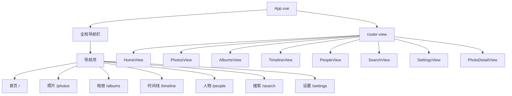
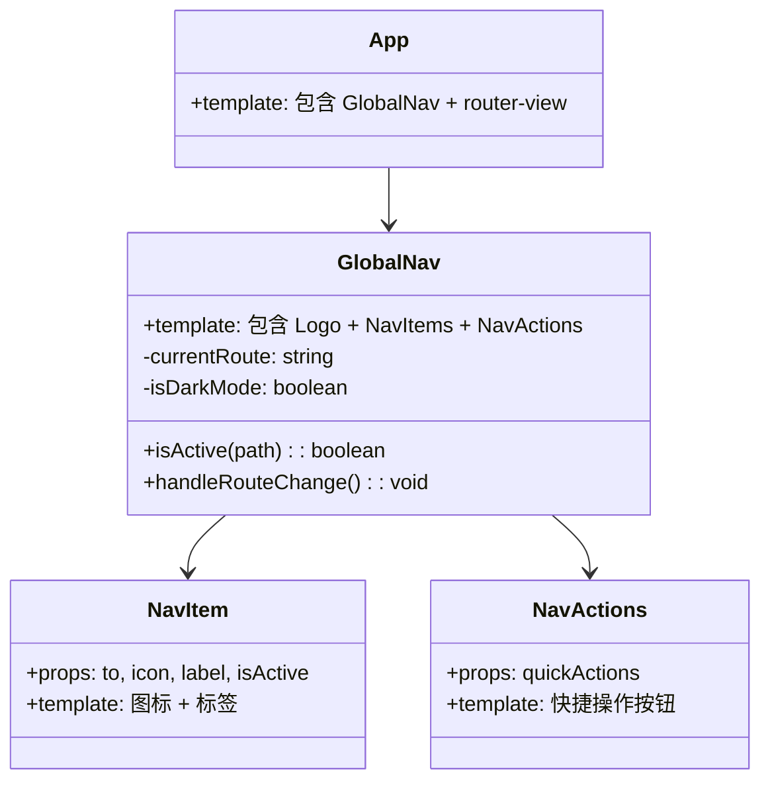
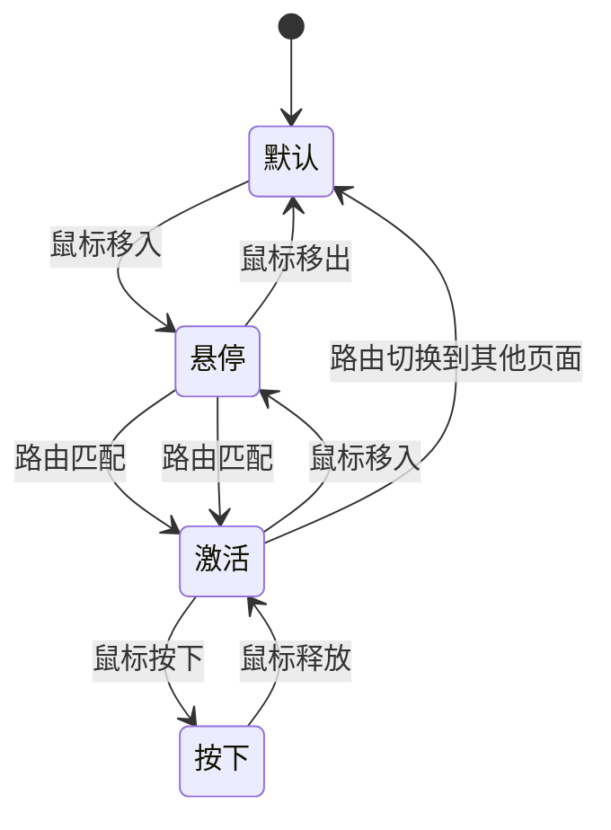

# PhotoMind 全局顶部导航栏详细设计

> **文档版本**: 1.1
> **创建日期**: 2026-02-06
> **更新日期**: 2026-02-06
> **项目**: PhotoMind - 智能相册管理应用
> **技术栈**: Vue 3 + Naive UI + Vue Router

---

## 1. 执行摘要

本文档描述了 PhotoMind 应用的全局顶部导航栏（Global Top Navigation Bar）的详细设计方案。当前应用中各视图（View）拥有独立的头部模式，缺乏统一的全局导航，导致用户在不同页面间切换时缺乏一致的导航体验。本设计通过引入全局顶部导航栏，实现以下目标：

- **统一的导航体验**：为所有页面提供一致的导航入口和视觉体验
- **清晰的定位**：让用户始终了解当前所在位置
- **高效的导航**：减少用户在不同功能模块间切换的认知负担
- **主题适配**：智能适配 PhotoDetailView 的暗色主题

导航栏将采用固定定位显示在页面顶部，包含 Logo、主要导航链接、快捷操作按钮和用户设置入口。

---

## 2. 设计目标

### 2.1 用户体验目标

| 目标 | 描述 | 优先级 |
|------|------|--------|
| **直观导航** | 用户能够快速理解导航结构并找到所需功能 | P0 |
| **一致性** | 导航栏在所有页面保持一致的外观和行为 | P0 |
| **主题适配** | 在深色主题页面自动切换为适配的配色方案 | P1 |
| **响应式设计** | 在不同屏幕尺寸下都能良好展示 | P2 |

### 2.2 技术目标

- **组件解耦**：导航栏作为独立组件，与各业务视图解耦
- **状态管理**：通过 Vue Router 钩子自动检测当前路由并更新导航状态
- **性能优化**：使用 CSS `position: fixed` 实现平滑滚动体验
- **主题切换**：支持根据页面类型自动切换浅色/深色主题

---

## 3. 导航结构

### 3.1 路由与导航项映射



### 3.2 导航项详细说明

| 路由路径 | 路由名称 | 导航标签 | 图标 | 优先级 | 说明 |
|----------|----------|----------|------|--------|------|
| `/` | Home | 首页 | Home24Regular | P0 | 应用主入口 |
| `/photos` | Photos | 照片 | Image24Regular | P1 | 照片列表浏览 |
| `/albums` | Albums | 相册 | Folder24Regular | P1 | 智能相册管理 |
| `/timeline` | Timeline | 时间线 | CalendarToday24Regular | P1 | 按时间浏览回忆 |
| `/people` | People | 人物 | People24Regular | P2 | 人物照片管理 |
| `/search` | Search | 搜索 | Search24Regular | P1 | 智能搜索入口 |
| `/settings` | Settings | 设置 | Settings24Regular | P3 | 应用设置 |

### 3.3 图标使用规范

所有图标来自 `@vicons/fluent`（Microsoft Fluent Icons）库：

```typescript
import {
  Home24Regular,
  Image24Regular,
  Folder24Regular,
  CalendarToday24Regular,
  People24Regular,
  Search24Regular,
  Settings24Regular,
  Add24Regular,
} from '@vicons/fluent'
```

---

## 4. 组件架构

### 4.1 文件结构

```
src/renderer/
├── components/
│   └── nav/
│       ├── GlobalNav.vue          # 主导航组件
│       ├── NavItem.vue            # 导航项组件
│       └── NavActions.vue         # 快捷操作区域
├── views/
│   ├── HomeView.vue              # 需要移除独立头部
│   ├── PhotosView.vue            # 需要移除独立头部
│   ├── AlbumsView.vue            # 需要移除独立头部
│   ├── TimelineView.vue          # 需要移除独立头部
│   ├── PeopleView.vue            # 需要移除独立头部
│   ├── SearchView.vue           # 需要移除独立头部
│   ├── SettingsView.vue          # 需要移除独立头部
│   └── PhotoDetailView.vue       # 特殊处理（暗色主题）
├── App.vue                       # 需要引入全局导航
└── router/
    └── index.ts                  # 路由配置（无变更）
```

### 4.2 组件关系图



### 4.3 组件职责

| 组件 | 职责 |
|------|------|
| `GlobalNav.vue` | 导航栏主容器，处理主题切换和路由监听 |
| `NavItem.vue` | 单个导航项，负责显示图标、标签和激活状态 |
| `NavActions.vue` | 右侧快捷操作区域（导入照片按钮等） |

---

## 5. 视觉设计规范

### 5.1 色彩规范

#### 浅色主题（默认）

| 属性 | 值 | 说明 |
|------|-----|------|
| 背景色 | `#FFFFFF` | 白色背景 |
| 前景色 | `#1a1a1a` | 主要文字颜色 |
| 品牌色 | `#5E6AD2` | 激活状态和强调色 |
| 次要文字 | `#666666` | 非激活状态文字 |
| 边框色 | `#E8E8ED` | 分隔线和边框 |
| 悬停背景 | `#F5F5F7` | 悬停状态背景 |
| 激活背景 | `#EDEFF5` | 激活状态背景 |

#### 深色主题（PhotoDetailView）

| 属性 | 值 | 说明 |
|------|-----|------|
| 背景色 | `#2a2a2a` | 深色背景 |
| 前景色 | `#FFFFFF` | 主要文字颜色 |
| 品牌色 | `#8B9EFF` | 激活状态和强调色（调亮） |
| 次要文字 | `#A0A0A0` | 非激活状态文字 |
| 边框色 | `#404040` | 分隔线和边框 |
| 悬停背景 | `#3A3A3A` | 悬停状态背景 |
| 激活背景 | `#404040` | 激活状态背景 |

### 5.2 尺寸规范

| 属性 | 值 | 说明 |
|------|-----|------|
| 导航栏高度 | `56px` | 固定高度 |
| Logo 区域宽度 | `140px` | Logo 和应用名称区域 |
| 导航项间距 | `8px` | 导航项之间的间距 |
| 导航项内边距 | `8px 12px` | 单个导航项的内边距 |
| 图标尺寸 | `20px` | 导航图标大小 |
| 文字大小 | `14px` | 导航文字大小 |
| 右侧操作区宽度 | `200px` | 快捷操作区域 |

### 5.3 圆角规范

| 属性 | 值 | 说明 |
|------|-----|------|
| 导航项圆角 | `6px` | 导航项的圆角大小 |
| Logo 区域圆角 | `8px` | Logo 区域的圆角 |
| 按钮圆角 | `8px` | 快捷操作按钮圆角 |

### 5.4 字体规范

```css
.nav-item {
  font-family: -apple-system, BlinkMacSystemFont, 'Segoe UI', Roboto, 'Helvetica Neue', Arial, sans-serif;
  font-size: 14px;
  font-weight: 500;
  letter-spacing: 0;
}

.logo {
  font-size: 18px;
  font-weight: 700;
  background: linear-gradient(135deg, #5E6AD2, #8B9EFF);
  -webkit-background-clip: text;
  -webkit-text-fill-color: transparent;
}
```

### 5.5 视觉布局

```
+------------------------------------------------------------------+
|  [Logo] PhotoMind    首页    照片    相册    时间线    人物       [+]  [Settings] |
+------------------------------------------------------------------+
```

**布局说明**：
- **左侧**：Logo 和应用名称
- **中央**：主导航链接（居中或左对齐）
- **右侧**：快捷操作按钮和设置入口

---

## 6. 交互设计

### 6.1 状态定义

| 状态 | 触发条件 | 视觉表现 |
|------|----------|----------|
| **默认** | 鼠标离开导航项 | 显示灰色图标和文字 |
| **悬停** | 鼠标移到导航项上 | 背景变为悬停色，文字颜色加深 |
| **激活** | 当前路由匹配 | 品牌色背景，品牌色文字，品牌色下边框 |
| **按下** | 鼠标按下导航项 | 背景进一步加深 |

### 6.2 状态转换图



### 6.3 交互效果代码示例

```scss
.nav-item {
  // 默认状态
  color: #666;
  background: transparent;

  // 悬停状态
  &:hover {
    background: #f5f5f7;
    color: #1a1a1a;
  }

  // 激活状态
  &.active {
    color: #5E6AD2;
    background: #edeff5;

    // 激活状态的下边框指示器
    &::after {
      content: '';
      position: absolute;
      bottom: 0;
      left: 50%;
      transform: translateX(-50%);
      width: 24px;
      height: 3px;
      background: #5E6AD2;
      border-radius: 2px 2px 0 0;
    }
  }

  // 按下状态
  &:active {
    transform: scale(0.98);
  }
}
```

### 6.4 过渡动画

```scss
.nav-item {
  transition: all 0.2s ease;

  // 图标过渡
  .nav-icon {
    transition: transform 0.2s ease;
  }

  // 悬停时图标轻微放大
  &:hover .nav-icon {
    transform: scale(1.1);
  }
}
```

### 6.5 路由切换动画

```typescript
// GlobalNav.vue - 路由监听
import { useRoute, onMounted, onUnmounted } from 'vue-router'

const route = useRoute()

// 监听路由变化，更新激活状态
const handleRouteChange = () => {
  // 自动更新当前激活的导航项
}
```

---

## 7. 特殊场景处理

### 7.1 PhotoDetailView 暗色主题适配

PhotoDetailView 使用全屏暗色背景（`#1a1a1a`），导航栏需要特殊处理：

```vue
<!-- GlobalNav.vue - 主题适配逻辑 -->
<template>
  <nav
    class="global-nav"
    :class="{ 'global-nav--dark': isDarkPage }"
  >
    <!-- 导航内容 -->
  </nav>
</template>

<script setup lang="ts">
import { computed, ref } from 'vue'
import { useRoute } from 'vue-router'

const route = useRoute()

// 检测是否为暗色主题页面
const isDarkPage = computed(() => {
  return route.name === 'PhotoDetail'
    || /^\/photo\/\w+/.test(route.path)
})
</script>

<style scoped>
.global-nav--dark {
  background: rgba(42, 42, 42, 0.95);
  backdrop-filter: blur(10px);
  border-bottom: 1px solid #404040;
}
</style>
```

### 7.2 页面边距调整

引入全局导航后，各视图需要调整顶部内边距：

```scss
// 现有视图（如 PhotosView）
.photos-container {
  padding-top: calc(56px + 24px); // 导航栏高度 + 原有间距
}

// 移除原有的独立 header
// .header { ... }
```

### 7.3 移动端适配

```scss
@media (max-width: 768px) {
  .global-nav {
    // 移动端：只显示图标，不显示文字
    .nav-label {
      display: none;
    }

    .nav-item {
      padding: 8px;
    }

    // Logo 区域缩小
    .nav-logo {
      width: 40px;
      .logo-text {
        display: none;
      }
    }
  }
}
```

### 7.4 窄屏幕适配

```scss
@media (max-width: 1024px) {
  .global-nav {
    // 只显示图标，文字在 tooltip 中显示
    .nav-label {
      display: none;
    }

    .nav-item {
      padding: 8px 12px;
    }

    // 添加 tooltip 提示
    .nav-item::before {
      content: attr(data-tooltip);
      position: absolute;
      bottom: -30px;
      left: 50%;
      transform: translateX(-50%);
      padding: 4px 8px;
      background: #1a1a1a;
      color: white;
      font-size: 12px;
      border-radius: 4px;
      opacity: 0;
      transition: opacity 0.2s;
      pointer-events: none;
    }

    .nav-item:hover::before {
      opacity: 1;
    }
  }
}
```

---

## 8. 实施步骤

### 8.1 阶段一：创建基础组件

**步骤 1.1：创建 NavItem 组件**

```vue
<!-- src/renderer/components/nav/NavItem.vue -->
<template>
  <router-link
    :to="to"
    class="nav-item"
    :class="{ active: isActive }"
  >
    <n-icon class="nav-icon" size="20">
      <component :is="icon" />
    </n-icon>
    <span class="nav-label">{{ label }}</span>
  </router-link>
</template>

<script setup lang="ts">
import { computed } from 'vue'
import { useRoute } from 'vue-router'

const props = defineProps<{
  to: string
  icon: any
  label: string
}>()

const route = useRoute()

const isActive = computed(() => {
  if (props.to === '/') {
    return route.path === '/'
  }
  return route.path.startsWith(props.to)
})
</script>
```

**步骤 1.2：创建 NavActions 组件**

```vue
<!-- src/renderer/components/nav/NavActions.vue -->
<template>
  <div class="nav-actions">
    <!-- 导入照片按钮 -->
    <n-button
      quaternary
      circle
      @click="handleImport"
      title="导入照片"
    >
      <template #icon>
        <n-icon size="20"><Add24Regular /></n-icon>
      </template>
    </n-button>

    <!-- 设置按钮 -->
    <n-button
      quaternary
      circle
      @click="goToSettings"
      title="设置"
    >
      <template #icon>
        <n-icon size="20"><Settings24Regular /></n-icon>
      </template>
    </n-button>
  </div>
</template>

<script setup lang="ts">
import { useRouter } from 'vue-router'
import { Add24Regular, Settings24Regular } from '@vicons/fluent'

const router = useRouter()

const handleImport = () => {
  // 触发导入流程
  console.log('[NavActions] 打开导入对话框')
}

const goToSettings = () => {
  router.push('/settings')
}
</script>
```

**步骤 1.3：创建 GlobalNav 主组件**

```vue
<!-- src/renderer/components/nav/GlobalNav.vue -->
<template>
  <nav
    class="global-nav"
    :class="{ 'global-nav--dark': isDarkPage }"
  >
    <div class="nav-container">
      <!-- Logo 区域 -->
      <div class="nav-logo" @click="goHome">
        <div class="logo-icon">
          <n-icon size="28" color="#5E6AD2">
            <Image24Regular />
          </n-icon>
        </div>
        <span class="logo-text">PhotoMind</span>
      </div>

      <!-- 主导航项 -->
      <div class="nav-items">
        <NavItem
          v-for="item in navItems"
          :key="item.path"
          :to="item.path"
          :icon="item.icon"
          :label="item.label"
        />
      </div>

      <!-- 快捷操作 -->
      <NavActions />
    </div>
  </nav>
</template>

<script setup lang="ts">
import { computed } from 'vue'
import { useRoute, useRouter } from 'vue-router'
import {
  Home24Regular,
  Image24Regular,
  Folder24Regular,
  CalendarToday24Regular,
  People24Regular,
  Search24Regular,
  Settings24Regular,
  Add24Regular,
} from '@vicons/fluent'
import NavItem from './NavItem.vue'
import NavActions from './NavActions.vue'

const route = useRoute()
const router = useRouter()

// 导航项配置
const navItems = [
  { path: '/', label: '首页', icon: Home24Regular },
  { path: '/photos', label: '照片', icon: Image24Regular },
  { path: '/albums', label: '相册', icon: Folder24Regular },
  { path: '/timeline', label: '时间线', icon: CalendarToday24Regular },
  { path: '/people', label: '人物', icon: People24Regular },
  { path: '/search', label: '搜索', icon: Search24Regular },
]

// 检测是否为暗色主题页面
const isDarkPage = computed(() => {
  return route.name === 'PhotoDetail'
    || route.path.startsWith('/photo/')
})

const goHome = () => {
  router.push('/')
}
</script>
```

### 8.2 阶段二：修改 App.vue

```vue
<!-- src/renderer/App.vue -->
<template>
  <n-config-provider :theme-overrides="themeOverrides">
    <n-loading-bar-provider>
      <n-message-provider>
        <n-notification-provider>
          <n-dialog-provider>
            <div class="app-container">
              <!-- 添加全局导航 -->
              <GlobalNav />

              <!-- 页面内容 -->
              <router-view v-slot="{ Component }">
                <transition name="fade" mode="out-in">
                  <component :is="Component" />
                </transition>
              </router-view>
            </div>
          </n-dialog-provider>
        </n-notification-provider>
      </n-message-provider>
    </n-loading-bar-provider>
  </n-config-provider>
</template>

<script setup lang="ts">
import { reactive, defineAsyncComponent } from 'vue'

// 异步加载全局导航组件
const GlobalNav = defineAsyncComponent(() =>
  import('./components/nav/GlobalNav.vue')
)

// 主题配置
const themeOverrides = reactive({
  common: {
    primaryColor: '#5E6AD2',
    primaryColorHover: '#7881E0',
    primaryColorPressed: '#4A55B8',
    borderRadius: '8px',
  },
  // ... 其他配置
})
</script>

<style>
/* 应用容器需要包含导航栏 */
.app-container {
  min-height: 100vh;
  display: flex;
  flex-direction: column;
}

/* 页面内容区域 */
.main-content {
  flex: 1;
  padding-top: 56px; /* 导航栏高度 */
}
</style>
```

### 8.3 阶段三：移除各视图的独立头部

需要修改以下文件，移除独立的 `<header class="header">`：

**需要修改的视图文件**：
- `src/renderer/views/HomeView.vue`
- `src/renderer/views/PhotosView.vue`
- `src/renderer/views/AlbumsView.vue`
- `src/renderer/views/TimelineView.vue`
- `src/renderer/views/PeopleView.vue`
- `src/renderer/views/SearchView.vue`
- `src/renderer/views/SettingsView.vue`

以 `PhotosView.vue` 为例：

```vue
<!-- 修改前 -->
<template>
  <div class="photos-container">
    <header class="header">
      <div class="header-left">
        <h1>照片</h1>
        ...
      </div>
    </header>
    ...
  </div>
</template>

<!-- 修改后 -->
<template>
  <div class="photos-container">
    <!-- 移除 header，添加内容容器 -->
    <div class="photos-content">
      <!-- 保留原有内容 -->
    </div>
  </div>
</template>

<style scoped>
.photos-container {
  padding-top: 80px; /* 导航栏高度 + 原有间距 */
}

.photos-content {
  max-width: 1200px;
  margin: 0 auto;
  padding: 0 24px;
}
</style>
```

### 8.4 阶段四：测试验证

**测试清单**：

| 测试项 | 预期结果 | 优先级 |
|--------|----------|--------|
| 导航栏固定在顶部 | 滚动页面时导航栏不移动 | P0 |
| 路由切换高亮正确 | 当前页面对应导航项高亮 | P0 |
| PhotoDetailView 暗色适配 | 导航栏自动切换为深色主题 | P0 |
| 移动端显示正常 | 窄屏幕下导航栏正常显示 | P1 |
| 快捷操作按钮可用 | 导入和设置按钮点击响应 | P1 |
| 页面过渡动画正常 | 页面切换时有平滑过渡 | P2 |

---

## 9. 代码示例

### 9.1 GlobalNav.vue 完整代码

```vue
<!-- src/renderer/components/nav/GlobalNav.vue -->
<template>
  <header
    class="global-nav"
    :class="{ 'global-nav--dark': isDarkPage }"
  >
    <div class="nav-container">
      <!-- Logo -->
      <div class="nav-logo" @click="goHome" title="返回首页">
        <div class="logo-icon">
          <n-icon size="28" :color="logoColor">
            <Image24Regular />
          </n-icon>
        </div>
        <span class="logo-text">PhotoMind</span>
      </div>

      <!-- 主导航 -->
      <nav class="nav-items">
        <router-link
          v-for="item in navItems"
          :key="item.path"
          :to="item.path"
          class="nav-item"
          :class="{ active: isActive(item.path) }"
        >
          <n-icon class="nav-icon" size="20">
            <component :is="item.icon" />
          </n-icon>
          <span class="nav-label">{{ item.label }}</span>
        </router-link>
      </nav>

      <!-- 右侧操作区 -->
      <div class="nav-actions">
        <!-- 导入按钮 -->
        <n-button
          quaternary
          circle
          :type="isDarkPage ? 'default' : 'primary'"
          @click="handleImport"
          title="导入照片"
        >
          <template #icon>
            <n-icon size="20"><Add24Regular /></n-icon>
          </template>
        </n-button>

        <!-- 设置按钮 -->
        <n-button
          quaternary
          circle
          :type="isDarkPage ? 'default' : 'primary'"
          @click="goToSettings"
          title="设置"
        >
          <template #icon>
            <n-icon size="20"><Settings24Regular /></n-icon>
          </template>
        </n-button>
      </div>
    </div>
  </header>
</template>

<script setup lang="ts">
import { computed, h } from 'vue'
import { useRoute, useRouter } from 'vue-router'
import { NIcon } from 'naive-ui'
import type { Component } from 'vue'
import {
  Home24Regular,
  Image24Regular,
  Folder24Regular,
  CalendarToday24Regular,
  People24Regular,
  Search24Regular,
  Settings24Regular,
  Add24Regular,
} from '@vicons/fluent'

// 图标渲染辅助函数
const renderIcon = (icon: Component) => {
  return () => h(NIcon, null, { default: () => h(icon) })
}

const route = useRoute()
const router = useRouter()

// 导航项配置
const navItems = [
  { path: '/', label: '首页', icon: Home24Regular },
  { path: '/photos', label: '照片', icon: Image24Regular },
  { path: '/albums', label: '相册', icon: Folder24Regular },
  { path: '/timeline', label: '时间线', icon: CalendarToday24Regular },
  { path: '/people', label: '人物', icon: People24Regular },
  { path: '/search', label: '搜索', icon: Search24Regular },
]

// 计算属性
const isDarkPage = computed(() => {
  return route.name === 'PhotoDetail'
    || route.path.startsWith('/photo/')
})

const logoColor = computed(() => {
  return isDarkPage.value ? '#8B9EFF' : '#5E6AD2'
})

// 方法
const isActive = (path: string): boolean => {
  if (path === '/') {
    return route.path === '/'
  }
  return route.path.startsWith(path)
}

const goHome = () => {
  router.push('/')
}

const goToSettings = () => {
  router.push('/settings')
}

const handleImport = () => {
  // 触发导入流程
  // 可以通过事件总线或 store 触发导入对话框
  window.dispatchEvent(new CustomEvent('open-import-dialog'))
}
</script>

<style scoped>
.global-nav {
  position: fixed;
  top: 0;
  left: 0;
  right: 0;
  height: 56px;
  background: #ffffff;
  border-bottom: 1px solid #e8e8ed;
  z-index: 1000;
  backdrop-filter: blur(10px);
  transition: all 0.3s ease;
}

/* 暗色主题变体 */
.global-nav--dark {
  background: rgba(42, 42, 42, 0.95);
  border-bottom-color: #404040;
}

.nav-container {
  max-width: 1400px;
  height: 100%;
  margin: 0 auto;
  padding: 0 24px;
  display: flex;
  align-items: center;
  justify-content: space-between;
}

/* Logo 区域 */
.nav-logo {
  display: flex;
  align-items: center;
  gap: 10px;
  cursor: pointer;
  transition: opacity 0.2s;
}

.nav-logo:hover {
  opacity: 0.8;
}

.logo-icon {
  display: flex;
  align-items: center;
  justify-content: center;
  width: 36px;
  height: 36px;
  background: linear-gradient(135deg, #5E6AD2, #8B9EFF);
  border-radius: 10px;
}

.logo-text {
  font-size: 18px;
  font-weight: 700;
  background: linear-gradient(135deg, #5E6AD2, #8B9EFF);
  -webkit-background-clip: text;
  -webkit-text-fill-color: transparent;
}

.global-nav--dark .logo-text {
  background: linear-gradient(135deg, #8B9EFF, #B8C3FF);
  -webkit-background-clip: text;
}

/* 导航项 */
.nav-items {
  display: flex;
  align-items: center;
  gap: 8px;
  flex: 1;
  justify-content: center;
}

.nav-item {
  display: flex;
  align-items: center;
  gap: 8px;
  padding: 8px 12px;
  border-radius: 8px;
  color: #666;
  text-decoration: none;
  transition: all 0.2s ease;
  font-size: 14px;
  font-weight: 500;
}

.nav-item:hover {
  background: #f5f5f7;
  color: #1a1a1a;
}

.nav-item.active {
  background: #edeff5;
  color: #5E6AD2;
}

/* 暗色主题下 */
.global-nav--dark .nav-item {
  color: #a0a0a0;
}

.global-nav--dark .nav-item:hover {
  background: #3a3a3a;
  color: #ffffff;
}

.global-nav--dark .nav-item.active {
  background: #404040;
  color: #8B9EFF;
}

/* 右侧操作区 */
.nav-actions {
  display: flex;
  align-items: center;
  gap: 8px;
  min-width: 100px;
  justify-content: flex-end;
}

/* 响应式 */
@media (max-width: 1024px) {
  .nav-label {
    display: none;
  }

  .nav-item {
    padding: 8px;
  }

  .logo-text {
    display: none;
  }

  .nav-logo {
    width: 36px;
    justify-content: center;
  }
}

@media (max-width: 768px) {
  .nav-items {
    gap: 2px;
  }

  .nav-item {
    padding: 6px;
    min-width: 44px;
    min-height: 44px;
  }
}
</style>
```

### 9.2 NavItem.vue 完整代码

```vue
<!-- src/renderer/components/nav/NavItem.vue -->
<template>
  <router-link
    :to="to"
    class="nav-item"
    :class="{ active: isActive }"
    :title="label"
  >
    <n-icon class="nav-icon" size="20">
      <component :is="icon" />
    </n-icon>
    <span class="nav-label">{{ label }}</span>
  </router-link>
</template>

<script setup lang="ts">
import { computed } from 'vue'
import { useRoute } from 'vue-router'
import type { Component } from 'vue'

const props = defineProps<{
  to: string
  icon: Component
  label: string
}>()

const route = useRoute()

const isActive = computed(() => {
  if (props.to === '/') {
    return route.path === '/'
  }
  return route.path.startsWith(props.to)
})
</script>

<style scoped>
.nav-item {
  display: flex;
  align-items: center;
  gap: 8px;
  padding: 8px 12px;
  border-radius: 8px;
  color: #666;
  text-decoration: none;
  transition: all 0.2s ease;
  font-size: 14px;
  font-weight: 500;
  cursor: pointer;
  position: relative;
}

.nav-item:hover {
  background: #f5f5f7;
  color: #1a1a1a;
}

.nav-item:hover .nav-icon {
  transform: scale(1.1);
}

.nav-item.active {
  background: #edeff5;
  color: #5E6AD2;
}

.nav-item.active::after {
  content: '';
  position: absolute;
  bottom: 0;
  left: 50%;
  transform: translateX(-50%);
  width: 20px;
  height: 3px;
  background: #5E6AD2;
  border-radius: 2px 2px 0 0;
}

.nav-icon {
  transition: transform 0.2s ease;
}

.nav-label {
  white-space: nowrap;
}
</style>
```

### 9.3 视图改造示例

以 `PhotosView.vue` 为例展示改造步骤：

```vue
<!-- src/renderer/views/PhotosView.vue -->
<template>
  <div class="photos-container">
    <!-- 移除原有的 header，添加内容包装器 -->
    <div class="photos-content">
      <!-- 工具栏 -->
      <div class="toolbar">
        <div class="toolbar-left">
          <h1 class="page-title">照片</h1>
          <p class="page-subtitle">{{ photoStore.totalCount }} 张照片</p>
        </div>
        <div class="toolbar-right">
          <n-button @click="refreshPhotos" :loading="photoStore.loading">
            <template #icon>
              <n-icon><ArrowClockwise24Regular /></n-icon>
            </template>
            刷新
          </n-button>
          <n-button-group>
            <n-button
              :type="viewMode === 'grid' ? 'primary' : 'default'"
              @click="viewMode = 'grid'"
            >
              <template #icon>
                <n-icon><Grid24Regular /></n-icon>
              </template>
            </n-button>
            <n-button
              :type="viewMode === 'list' ? 'primary' : 'default'"
              @click="viewMode = 'list'"
            >
              <template #icon>
                <n-icon><List24Regular /></n-icon>
              </template>
            </n-button>
          </n-button-group>
        </div>
      </div>

      <!-- 照片内容 -->
      ...
    </div>
  </div>
</template>

<script setup lang="ts">
// ... 现有脚本保持不变
</script>

<style scoped>
.photos-container {
  min-height: 100vh;
  background: #f5f5f7;
  padding-top: 80px; /* 导航栏高度 56px + 额外间距 */
}

.photos-content {
  max-width: 1200px;
  margin: 0 auto;
  padding: 0 24px 24px;
}

.toolbar {
  display: flex;
  justify-content: space-between;
  align-items: flex-start;
  margin-bottom: 24px;
}

.toolbar-left {
  display: flex;
  flex-direction: column;
}

.page-title {
  font-size: 24px;
  font-weight: 700;
  color: #1a1a1a;
  margin: 0;
}

.page-subtitle {
  color: #666;
  margin: 4px 0 0;
  font-size: 14px;
}

.toolbar-right {
  display: flex;
  gap: 12px;
}
</style>
```

---

## 10. 增强功能（可选）

### 10.1 添加工具提示组件

对于移动端隐藏文字标签的情况，建议使用 Naive UI 的 NTooltip 组件：

```vue
<!-- src/renderer/components/nav/NavItem.vue -->
<template>
  <NTooltip>
    <template #trigger>
      <router-link
        :to="to"
        class="nav-item"
        :class="{ active: isActive }"
      >
        <n-icon class="nav-icon" size="20">
          <component :is="icon" />
        </n-icon>
        <span class="nav-label">{{ label }}</span>
      </router-link>
    </template>
    {{ label }}
  </NTooltip>
</template>

<script setup lang="ts">
import { NTooltip } from 'naive-ui'
// ... 其他代码
</script>
```

### 10.2 键盘导航支持

添加键盘快捷键支持，方便高级用户快速导航：

```typescript
// 在 GlobalNav.vue 中添加
<script setup lang="ts">
import { onMounted, onUnmounted } from 'vue'

const handleKeydown = (event: KeyboardEvent) => {
  if (event.altKey) {
    const keyMap: Record<string, string> = {
      '1': '/',
      '2': '/photos',
      '3': '/albums',
      '4': '/timeline',
      '5': '/people',
      '6': '/search',
      'h': '/',
      ',': '/settings',
    }
    if (keyMap[event.key]) {
      router.push(keyMap[event.key])
    }
  }
}

onMounted(() => {
  window.addEventListener('keydown', handleKeydown)
})

onUnmounted(() => {
  window.removeEventListener('keydown', handleKeydown)
})
</script>
```

### 10.3 移动端底部安全区域适配

在移动设备上需考虑 iOS 的底部安全区域：

```scss
@media (max-width: 768px) {
  .global-nav {
    padding-bottom: env(safe-area-inset-bottom, 0);
  }
}
```

---

## 10. 增强功能（可选）

### 10.1 添加工具提示组件

对于移动端隐藏文字标签的情况，建议使用 Naive UI 的 NTooltip 组件：

```vue
<!-- src/renderer/components/nav/NavItem.vue -->
<template>
  <NTooltip>
    <template #trigger>
      <router-link
        :to="to"
        class="nav-item"
        :class="{ active: isActive }"
      >
        <n-icon class="nav-icon" size="20">
          <component :is="icon" />
        </n-icon>
        <span class="nav-label">{{ label }}</span>
      </router-link>
    </template>
    {{ label }}
  </NTooltip>
</template>

<script setup lang="ts">
import { NTooltip } from 'naive-ui'
// ... 其他代码
</script>
```

### 10.2 键盘导航支持

添加键盘快捷键支持，方便高级用户快速导航：

```typescript
// 在 GlobalNav.vue 中添加
<script setup lang="ts">
import { onMounted, onUnmounted } from 'vue'

const handleKeydown = (event: KeyboardEvent) => {
  if (event.altKey) {
    const keyMap: Record<string, string> = {
      '1': '/',
      '2': '/photos',
      '3': '/albums',
      '4': '/timeline',
      '5': '/people',
      '6': '/search',
      'h': '/',
      ',': '/settings',
    }
    if (keyMap[event.key]) {
      router.push(keyMap[event.key])
    }
  }
}

onMounted(() => {
  window.addEventListener('keydown', handleKeydown)
})

onUnmounted(() => {
  window.removeEventListener('keydown', handleKeydown)
})
</script>
```

### 10.3 移动端底部安全区域适配

在移动设备上需考虑 iOS 的底部安全区域：

```scss
@media (max-width: 768px) {
  .global-nav {
    padding-bottom: env(safe-area-inset-bottom, 0);
  }
}
```

---

## 11. 总结

本设计文档详细描述了 PhotoMind 应用全局顶部导航栏的设计方案，包括：

1. **统一的导航结构**：覆盖所有主要路由，提供一致的导航体验
2. **响应式设计**：支持桌面端和移动端的差异展示
3. **主题适配**：智能适配 PhotoDetailView 的暗色主题
4. **组件化实现**：模块化的组件结构，便于维护和扩展
5. **清晰的实施步骤**：分阶段实施指南，降低实施风险

实施本设计方案后，用户将能够：
- 在任何页面快速访问主要功能
- 清晰了解当前所在位置
- 享受一致且流畅的导航体验

---

> **文档版本**: 1.1
> **最后更新**: 2026-02-06
> **作者**: PhotoMind Design Team
